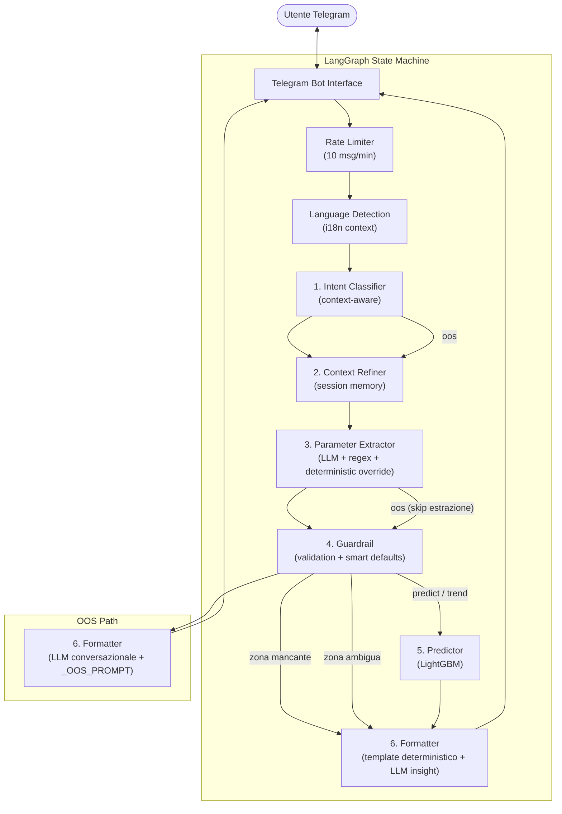

# NYC Taxi Bot — Architettura Tecnica 🚕🧠

Questo documento descrive l'architettura tecnica del bot Telegram per la previsione della disponibilità dei taxi a New York City.

## 🏗️ Visione d'Insieme (v4.1 — StateGraph)
L'architettura attuale utilizza un **Custom State Graph** (LangGraph) per gestire il flusso della conversazione in modo deterministico.

---

## 🧩 Nodi del Grafo

### 1. Intent Classifier (`intent_classifier_node`)
Classifica l'intent dell'utente in `predict`, `trend`, o `oos`.  
**Context-aware**: include gli ultimi ~3 turni (max 6 messaggi) nel prompt per rilevare 
messaggi di **follow-up** (es. _"e alle 17:30?"_ dopo una predizione → `predict`, non `oos`).

- **Predict**: richiesta di disponibilità in tempo reale.
- **Trend**: richiesta di pattern storici (Tabular RAG).
- **OOS**: richiesta fuori dominio → il Formatter genera una risposta conversazionale via LLM.

### 2. Parameter Extractor (`extractor_node`)
Estrae i parametri rilevanti dal testo usando un sistema a tre livelli:
- **Regex fast-path**: per comandi interni tipo `"Zona ID 161"` (click su bottoni).
- **LLM semantico** (`InputValidator._llm_extract`): estrae zona, ora, giorno, mese dal linguaggio naturale.
- **Override deterministico** (`_deterministic_override`): sovrascrive il risultato LLM se un nome di giorno/mese è esplicito nel testo originale (100% accuratezza).

**Multi-turn merge**: i parametri del turno precedente (`current_params`) vengono mantenuti e solo i nuovi valori espliciti li sovrascrivono.  
Esempio: _"JFK lunedì"_ → turno dopo _"e alle 17:30?"_ → mantiene JFK+lunedì, aggiorna solo l'ora.

Supporta anche **fasce orarie** (_"pomeriggio"_, _"sera"_) che generano una lista di ore per predizioni aggregate.

Per intent `oos`, salta l'estrazione e procede direttamente al Guardrail (→ Formatter).

### 3. Guardrail (`guardrail_node`)
Validazione logica dei parametri merged:
- Se manca la zona e ci sono candidati → routing a `disambiguate`.
- Se manca la zona senza candidati → routing a `ask_zone`.
- Valida i range (ID zona 1-265, ora 0-23, mese 1-12).
- Applica **smart defaults** per i parametri temporali assenti (usa `datetime.now()`).

### 4. Predictor (`predictor_node`)
Esegue il modello LightGBM una o più volte:
- **Singolo orario**: calcola il bucket 30-min e fa una predizione con confidenza.
- **Fascia oraria** (es. _"pomeriggio"_): itera su tutte le ore della fascia e aggrega.
- **Trend** (`intent=trend`): usa i dati storici aggregati (Tabular RAG).
- **Vehicle type routing**:
  - `vehicle_type = "fhvhv"` → FHvhvPredictor (Uber/Lyft)
  - `vehicle_type = "all" | None` → YGPredictor.predict_all (3 risultati: yellow hail + green hail + dispatch)
  - `vehicle_type = "yellow"` → YGPredictor.predict yellow hail (1 risultato)
  - `vehicle_type = "green"` → YGPredictor.predict green hail + dispatch (2 risultati)

### 5. Formatter (`formatter_node`)
Gestore ibrido della risposta finale:

| Scenario | Comportamento |
|---|---|
| `intent = oos` | Chiama l'LLM con `_OOS_PROMPT` + conversation history. Risposta conversazionale contestuale, max 2-3 frasi. Fallback su stringa predefinita se l'LLM fallisce. |
| Errori di validazione | Template deterministico con descrizione errore e suggerimento formato. |
| Zona mancante / ambigua | Messaggio di clarification o lista bottoni disambiguation. |
| Predizione riuscita | **Template deterministico** (emoji, dati strutturati) + **insight LLM** arricchito con **RAG context** (2-3 frasi MAX, stesso lingua dell'utente). |
| FHVHV (Uber/Lyft) | Template specifico con ⏱️ tempo di attesa stimato, emoji per classe (Facile/Medio/Difficile). |

---

## 🛠️ Tecnologie Utilizzate
- **Orchestrazione**: LangGraph (`StateGraph`).
- **LLM primario**: Groq Cloud (`llama-3.3-70b` o equivalente) via `langchain-groq`.
- **LLM fallback**: Ollama locale (`llama3.2:3b`) — nessuna API key necessaria.
- **Factory LLM**: `llm_factory.py` → `get_llm()` centralizza la scelta del provider.
- **ML Engine**: LightGBM + SHAP (predizioni + spiegabilità).
- **FHVHV Model**: `Roberto` - LightGBM dedicato per Uber/Lyft (modello separato, file `fhvhv_model.pkl`).
- **RAG**: Due sistemi: (1) Tabular RAG via CSV per Historical Trends (intent `trend`), (2) Semantic RAG con FAISS per arricchire gli insight LLM nel Formatter.
- **Interface**: Python Telegram Bot (Inline Keyboards per disambiguation).
- **In-Memory Caching (Nuovo)**: `cachetools` con `TTLCache` per le sessioni utente e limits (memory-leak safe).

---

## 🌍 Internazionalizzazione (i18n) e Sicurezza
- **Rate Limiting**: Utilizzato un `TTLCache(maxsize=1000, ttl=60)` per limitare spam da botnet e click compulsivi. Blocco a 10 messaggi al minuto.
- **Supporto multi-lingua**: Struttura `i18n.py` e mapping linguistico (`get_msg(lang, "key")`) estratti nel context di Telegram usando `update.effective_user.language_code`. Pass-through della variabile nello State Graph a livello di agent ed LLM per risposte coerenti (`"en"`, `"it"`).

---

## 📜 Prompt centralizzati

I prompt sono ora centralizzati in `prompts.py` per una migliore manutenibilità:

| Costante | Nodo | Scopo |
|---|---|---|
| `_INTENT_PROMPT` | Intent Classifier | Classifica in `predict`/`trend`/`oos`. Include regola follow-up. |
| `_OOS_PROMPT` | Formatter (OOS) | Definisce identità e confini del bot. Risposta conversazionale, no dominio esterno. |
| `_INSIGHT_PROMPT` | Formatter (predict) | Genera insight 2-3 frasi sui dati di predizione. |
| `_EXTRACTION_SYSTEM_PROMPT` | InputValidator | Estrae parametri strutturati (zona, ora, giorno, mese) dal linguaggio naturale. |

---

## 🚀 Vantaggi del Grafo Deterministico
- **Controllo Totale**: Il flusso è esplicito e tracciabile — ogni nodo stampa il proprio stato nei log.
- **Robustezza multi-turn**: l'extractor fa merge dei parametri (mantiene i precedenti, sovrascrive solo i nuovi valori).
- **Follow-up intelligente**: l'Intent Classifier usa la history per rilevare messaggi contestuali.
- **OOS conversazionale**: instead of a canned string, l'LLM risponde in modo naturale ricordando il suo scopo.
- **LLM minimale**: usato solo dove aggiunge valore (intent, extraction, OOS, insight); tutto il resto è deterministico.
- **Prompt centralizzati**: tutti i prompt di sistema in un unico file (`prompts.py`) per facilità di modifica.
